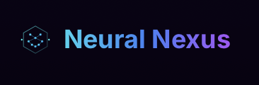

# Neural-Nexus-Package
_Made by Drago_

<div align="center">

[](https://www.npmjs.com/package/neural-nexus-pkg)
[](https://github.com/Drago-03/neural-nexus-pkg/actions)
[](https://www.npmjs.com/package/neural-nexus-pkg)
[](https://opensource.org/licenses/MIT)
[](http://makeapullrequest.com)
[](https://www.typescriptlang.org/)




<h3>A modern toolkit for connecting with AI models on the Neural Nexus platform</h3>

<p align="center">
  <a href="#installation">Installation</a> •
  <a href="#quick-start">Quick Start</a> •
  <a href="#api-reference">API Reference</a> •
  <a href="#examples">Examples</a> •
  <a href="#development">Development</a>
</p>

</div>

A cutting-edge package for Neural Nexus platform that lets you connect with AI models, deploy them, and get marketplace access without breaking a sweat.

## Features

- **Model Management** - Upload, download, and manage your AI models
- **Marketplace Integration** - Buy, sell, and share models with the community
- **Authentication** - Secure login with multiple providers
- **Payments** - Process payments with Stripe and Crypto options
- **Profile Management** - Handle user profiles and settings

## Installation

```bash
npm install neural-nexus-pkg
# or
yarn add neural-nexus-pkg
```

## Quick Start

```typescript
import { NeuralNexus, ModelManager } from 'neural-nexus-pkg';

// Initialize the client
const nexus = new NeuralNexus({
  apiKey: 'your-api-key',
  environment: 'production' // or 'development'
});

// Upload a model
const modelManager = new ModelManager(nexus);
const result = await modelManager.uploadModel({
  name: 'My Awesome Model',
  description: 'This model is fire!',
  files: [/* your model files */],
  tags: ['vision', 'classification', 'neural-network'],
  isPublic: true
});

console.log(`Model uploaded! ID: ${result.modelId}`);

// Generate SDK code for Python
const pythonSdk = nexus.sdk.generateSdk({
  language: 'python',
  includeExamples: true,
  prettyPrint: true
});

console.log(`Generated Python SDK! Length: ${pythonSdk.length} characters`);
```

## Package Stats

<div align="center">
  
</div>

## API Reference

### NeuralNexus

Main client class for interacting with the Neural Nexus platform.

```typescript
const nexus = new NeuralNexus(config);
```

### ModelManager

Handles model operations like uploading, downloading, and searching.

```typescript
const modelManager = new ModelManager(nexus);
const models = await modelManager.searchModels({ tag: 'vision' });
```

### Auth

Handles authentication operations.

```typescript
const auth = new Auth(nexus);
await auth.login(email, password);
```

### Marketplace

Interact with the Neural Nexus marketplace.

```typescript
const marketplace = new Marketplace(nexus);
const trending = await marketplace.getTrendingModels();
```

### Payments

Process payments and handle transactions.

```typescript
const payments = new Payments(nexus);
await payments.purchaseModel(modelId, { method: 'stripe' });
```

### SDK Manager

Generate code for different programming languages to use the Neural Nexus API.

```typescript
// Generate TypeScript SDK
const typescriptCode = nexus.sdk.generateSdk({
  language: 'typescript',
  includeExamples: true,
  prettyPrint: true
});

// Check supported languages
const supportedLanguages = nexus.sdk.getSupportedLanguages();
console.log(supportedLanguages); // ['typescript', 'javascript', 'python', 'go', 'java', 'ruby', 'csharp', 'php', 'swift', 'rust']

// Check if a language is supported
const isSupported = nexus.sdk.isLanguageSupported('cobol');
console.log(isSupported); // false
```

### Supported Languages

<div align="center">
  <p>
    <a href="#typescript"></a>
    <a href="#javascript"></a>
    <a href="#python"></a>
    <a href="#go"></a>
    <a href="#java"></a>
  </p>
  <p>
    <a href="#ruby"></a>
    <a href="#csharp"></a>
    <a href="#php"></a>
    <a href="#swift"></a>
    <a href="#rust"></a>
  </p>
</div>

## Integration Ecosystem

<div align="center">
  
</div>

## Examples

Check the `/examples` directory for more detailed examples of how to use this package.

<div align="center">
  
</div>

## Development

### Preparing for Publishing

Before publishing a new version, run the prepare-publish script:

```bash
npm run prepare-publish
```

This will:
1. Run linting to ensure code quality
2. Run tests to ensure everything works correctly
3. Build the package for distribution

### Publishing

To publish a new version:

1. Update the version in `package.json`
2. Run the prepare-publish script
3. Publish to npm:

```bash
npm publish
```

## Join Our Community

<div align="center">
  <a href="https://discord.gg/neuralnexus">
    
  </a>
  <p>Join our growing community of developers and AI enthusiasts!</p>
</div>

## Contributors

<div align="center">
  <a href="https://github.com/Drago-03/neural-nexus-pkg/graphs/contributors">
    
  </a>
</div>

## Contributing

<div align="center">
  
</div>

Contributions are welcome! Please check out our [Contributing Guide](CONTRIBUTING.md) for details.

## License

This project is licensed under the MIT License - see the [LICENSE](LICENSE) file for details.

## Acknowledgments

- Built on top of the [Neural Nexus](https://github.com/Drago-03/Neural-Nexus) platform
- Shoutout to all the devs making AI more accessible!

<div align="center">
  <sub>Built with ❤︎ by <a href="https://github.com/Drago-03">Drago-03</a></sub>
</div>
